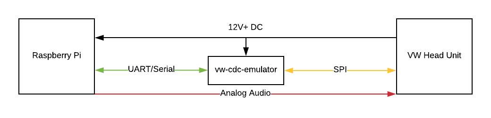

# vw-cdc-emulator [![Build Status][build.svg]][build]

An Arduino, AVR-based CD changer emulator for Volkswagen car audio head units, allowing bidirectional communication
with the in-car stereo system over a serial connection from the board to another device.

## Use Case

VW head units speak an ill-documented protocol with CD changer devices located usually in the back of the car. My goal
is to replace my [PhatNoise Media System](./PHATNOISE.md) with an arbitrary computing platform.

My motivation in creating this VW CD Changer Emulator is to make a simple embedded board which will allow me to build
my own [PhatNoise-esque](./PHATNOISE.md) system with complete control over the head unit. The architecture I'm currently
working with will consist of:

 1. Hopefully, a _very_ minimal Arduino board, as the only physical requirements are four pins for [SPI][spi]
    communication with the head unit, and [UART][uart] or a [Serial Port][serial] for external communication with an
    application driving the head unit and responding to key presses/events.
 1. A Raspberry Pi or other small, low-power computer which will bidirectionally communicate with the Arduino board
    over UART/Serial.
 1. A daemon written in [Rust](https://rust-lang.org) for streaming analog audio to the head unit and controlling media
    playback.
 1. A voltage regulator and battery, keying off of the 12V+ DC accessory power supply, which is only on when the key is
    turned to or past the accessory switch.

Once this very simple setup has been achieved, other experiments may follow:

 - Put a Bluetooth receiver on the Raspberry Pi and write an Android application which will be able to communicate with
   the Raspberry Pi from my phone.
 - Put an LTE antenna and SIM card for roaming internet access.
 - Put one or two WiFi antennas, one as a client to be able to connect to my home WiFi and one as a server for in-car
   communication.
 - Use [Syncthing](https://syncthing.net/) to keep my music library in sync on the Raspberry Pi and my other home devices.

Having a full computing platform in the back of the car will enable lots of other exciting experiments and projects.

## License

Licensed at your discretion under either:

 - [Apache Software License, Version 2.0](./LICENSE-APACHE)
 - [MIT License](./LICENSE-MIT)

 [build]: https://travis-ci.org/naftulikay/vw-cdc-emulator
 [build.svg]: https://travis-ci.org/naftulikay/vw-cdc-emulator.svg?branch=master
 [phatnoise.rs]: https://github.com/naftulikay/phatnoise.rs
 [serial]: https://en.wikipedia.org/wiki/Serial_port
 [spi]: https://en.wikipedia.org/wiki/Serial_Peripheral_Interface
 [uart]: https://en.wikipedia.org/wiki/Universal_asynchronous_receiver-transmitter
